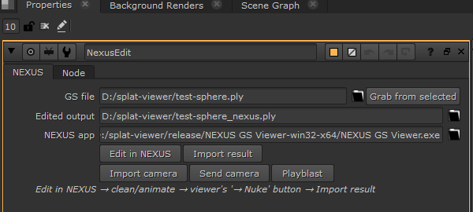

<div align="center">


# Nexus x Nuke

**Edit Gaussian Splats from inside Nuke — one click out to [NEXUS GS Viewer](https://github.com/NXStorm/nexus-gs-viewer), one click back.**


📬 Building AI × VFX pipeline tools. Follow along and get new tools + breakdowns first → [Patrick Crucke on LinkedIn](https://www.linkedin.com/in/patrick-crucke/)

</div>

---

## What it does

**Nexus x Nuke** bridges Nuke and [**NEXUS GS Viewer**](https://github.com/NXStorm/nexus-gs-viewer), the open-source Gaussian Splatting viewer & editor. From a single node in your script:

1. **Edit in NEXUS** — opens your splat file (`.ply`, `.spz`, `.splat`, `.ksplat`) in the viewer
2. Clean it up there — keep/erase shapes, eraser brush, splat selection, bake — then hit the viewer's **→ Nuke** button
3. **Import result** — the edited splats land back in your script as a **GeoImport**, ready to view (select it, `V`, then `Tab` for 3D)

Perfect companion to [Marble-x-Nuke](https://github.com/NXStorm/Marble-x-Nuke): generate a world with Marble, clean and previz it with NEXUS, composite in Nuke — without ever leaving your pipeline.

<div align="center">

</div>

## Why it matters

Splat scans and generated worlds arrive noisy — floaters, stray ground, blown edges. Cleaning them used to mean exporting, hunting for a standalone tool, re-importing by hand. Now it's a round-trip built into the node graph: the file paths are managed for you, the viewer opens on the right file, and the result snaps back next to the node that sent it.

## Installation

### 1. Install NEXUS GS Viewer

Grab it from the [releases page](https://github.com/NXStorm/nexus-gs-viewer/releases) (Windows, macOS, Linux). Launch it once — on Windows it registers itself so the plugin finds it automatically.

### 2. Copy the plugin

Copy the `NexusXnuke/` folder into your `.nuke` directory:

| OS | Path |
| --- | --- |
| Windows | `C:\Users\<YourName>\.nuke\NexusXnuke\` |
| macOS | `/Users/<YourName>/.nuke/NexusXnuke/` |
| Linux | `/home/<YourName>/.nuke/NexusXnuke/` |

### 3. Register the plugin

Open (or create) `init.py` inside your `.nuke` directory and add:

```python
import nuke, os
nuke.pluginAddPath(os.path.join(os.path.expanduser("~/.nuke"), "NexusXnuke"))
```

That's it. A **NexusXnuke** menu appears in the Nodes toolbar.

## Usage

1. Create a **NEXUS Edit** node from the NexusXnuke menu
2. Set **GS file** — or select your GeoImport/ReadGeo and click **Grab from selected**
3. Click **Edit in NEXUS** → the viewer opens on your file
4. Clean, animate, playblast… then click the viewer's **→ Nuke** button
5. Back in Nuke, click **Import result** → a `NexusResult` GeoImport appears (select, `V`, `Tab`)

**Camera round-trip** — **Import camera** creates an animated Nuke Camera from the shot you blocked in NEXUS (written next to the round-trip file when you click → Nuke with ≥2 keys); **Send camera** exports the selected Nuke Camera (ZXY) and replays it on the splats in the viewer. The `.chan` focal is written for Nuke's default 24.576 mm horizontal aperture, so an unmodified Camera node matches the playblast frame-for-frame (verified in Nuke 17; requires NEXUS GS Viewer ≥ 0.13.2 or NEXUS 4D Viewer ≥ 0.4.0).

**Playblast** — renders the scene through the viewer's headless CLI (saved animation or auto-orbit, 1080p at your project fps) and drops the MP4 into a Read node when done.

The **Edited output** path defaults to `<source>_nexus.ply`; the **NEXUS app** path is auto-detected (registry on Windows, `/Applications` on macOS) and remembered between sessions. You can also set the `NEXUS_GS_VIEWER` environment variable.

## Requirements

- Nuke 15+ (Commercial, Indie or Non-Commercial) — tested on 15.2 and 17.0
- [NEXUS GS Viewer](https://github.com/NXStorm/nexus-gs-viewer/releases) **0.13 or newer** (the `--roundtrip` contract)
- No external Python packages

## Troubleshooting

| Problem | Solution |
| --- | --- |
| "NEXUS GS Viewer not found" | Set the **NEXUS app** knob to the executable (or the `NEXUS_GS_VIEWER` env var) |
| "No edited file yet" on import | In the viewer, click the **→ Nuke** button first — it writes the round-trip file |
| Edited splats lost their view-dependent shading | Expected: NEXUS cleanup rebuilds splats without SH>0 harmonics — fine for previz |
| The viewer opens but without the → Nuke button | Update NEXUS GS Viewer to 0.13+ |

## License

Released under the [MIT License](LICENSE). Free to use, modify, and ship in commercial work.

## Credits

- [NEXUS GS Viewer](https://github.com/NXStorm/nexus-gs-viewer) — the editor this plugin talks to
- Foundry — for Nuke, the compositing standard

Built and maintained by **SINAI R&D** — [Patrick Crucke](https://www.linkedin.com/in/patrick-crucke/).

If this project saved you time, a ⭐ on the repo goes a long way.
